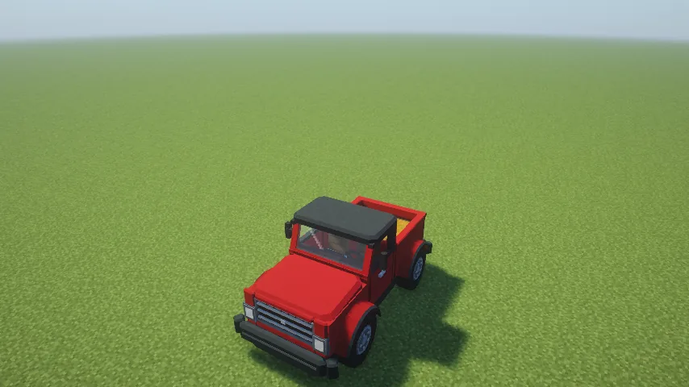
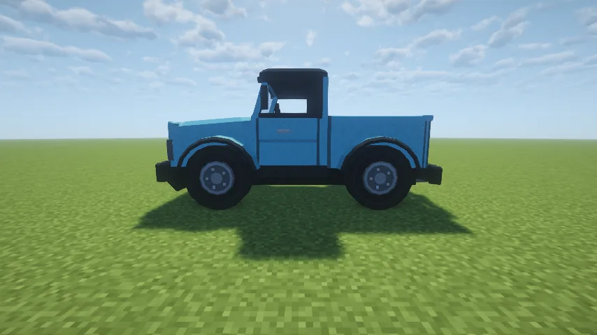
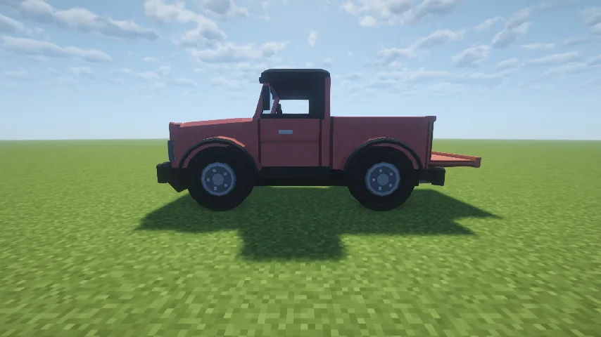
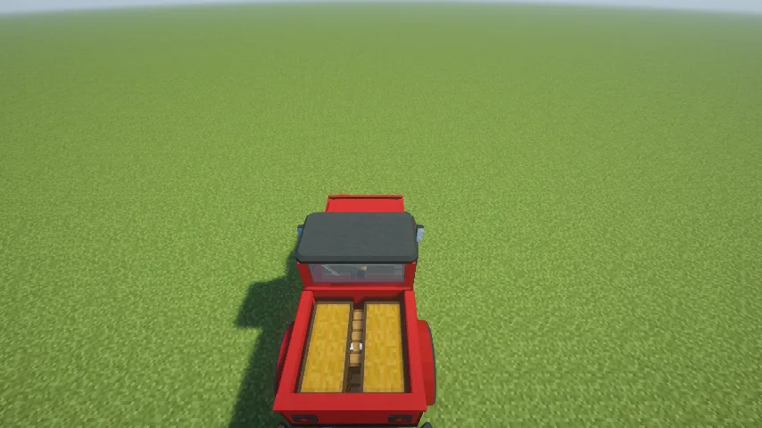
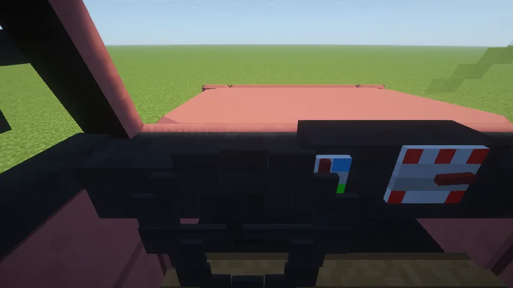
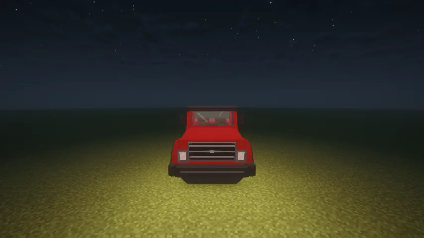

The **Farmer's Pickup** is a red single-cab farm truck, built by nfx. It seats two and has a
working **tailgate**, **two chests** in the bed, a dash with a speedometer and a fuel gauge,
headlights, a horn, a radio and a hitch for the [Trailer](/wiki/trailer). Everything about
driving it (fuel, drifting, keys, repairs, towing) is [Vanilla Wheels](/wiki/vanilla-wheels)'s,
so read that page too.

## Getting one

1. **The chassis:** eight iron blocks around a hay bale.
2. **The parts:** four **wheels** and an **engine** (recipes on the
   [Vanilla Wheels](/wiki/vanilla-wheels#building-the-mechanic-lift) page).
3. **Build it** on a **Mechanic Lift**: chassis, wheels and engine in its slots, then **Build**.
   It comes out red; put a dye in the lift and press **Paint** to change it (the tailgate's
   panels too).
4. **Fuel it:** hold right-click at it with a full gas can.

## Driving it

- **Right-click** to get in (the driver's seat first); **crouch** to get out.
- **Movement keys** drive; hold **jump** in a turn to drift, and let go for a boost.
- **Left Control** is the horn; **H** cycles the headlights.
- Look down from the driver's seat: the dials on the dash show your **speed** and your **fuel**.
- **The tailgate:** crouch and right-click it, empty-handed, anywhere on it, to drop or raise it.
- **The chests:** right-click either chest in the bed to open it, or press your inventory key
  while riding for the left one. Each has six rows.
- **Music:** crouch and right-click with a music disc to play it; crouch and right-click the dash
  empty-handed to take it out.
- **Towing:** hold a trailer and right-click the truck to hitch it behind, or back the rear hitch
  onto a loose trailer's tongue.

## What it can do

| | |
|---|---|
| Top speed | 0.9 blocks a tick, the Trailblazer's |
| Climbs | one-block steps without jumping; a two-block ledge is a wall |
| Size | 6½ blocks long, 2½ wide, 3 high |
| Garage door | needs one four blocks high |
| Repair by hand | 4.5 food points of hunger for a full rebuild |
| Repair on the Mechanic Lift | 18 iron ingots for a full repair |

